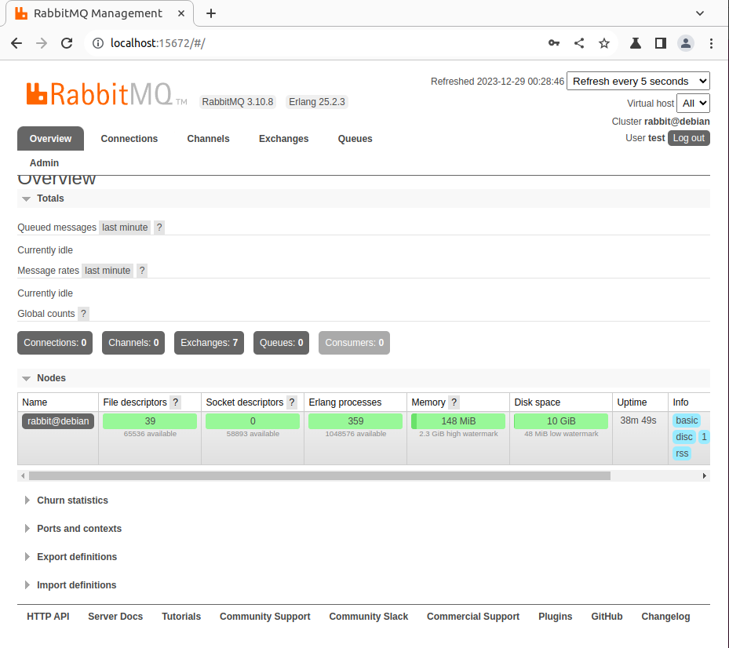
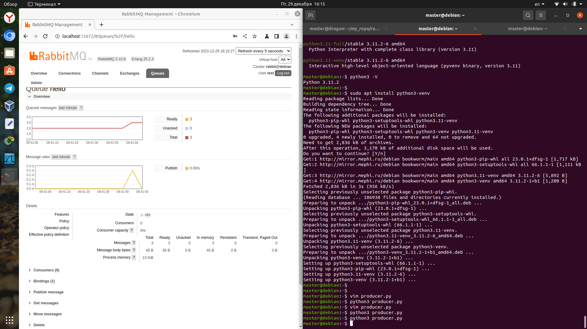
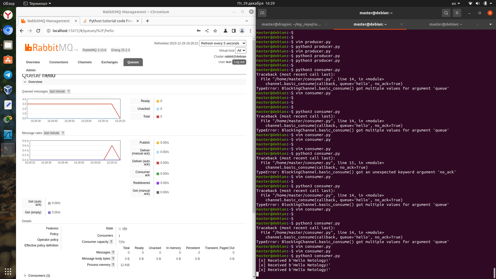

# Домашнее задание к занятию "`Очереди RabbitMQ`" - `Аблогин Павел`

---

### Задание 1

`Установил RabbitMQ. Добавил management plug-in.`

`Скриншот выполнения задания 1`



---

### Задание 2

1. `Установил пакет python pika`
2. `Отправил сообщения в очередь скриптом producer.py`
3. `Вычитал сообщения из очереди скриптом consumer.py`

`Скриншоты выполнения задания 2`




---

### Задание 3

`Приведите ответ в свободной форме........`

1. `Заполните здесь этапы выполнения, если требуется ....`
2. `Заполните здесь этапы выполнения, если требуется ....`
3. `Заполните здесь этапы выполнения, если требуется ....`
4. `Заполните здесь этапы выполнения, если требуется ....`
5. `Заполните здесь этапы выполнения, если требуется ....`
6. 

```
Поле для вставки кода...
....
....
....
....
```

`При необходимости прикрепитe сюда скриншоты
`


---


