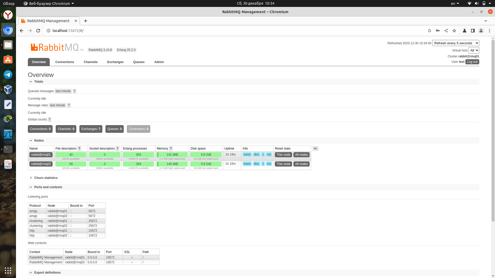
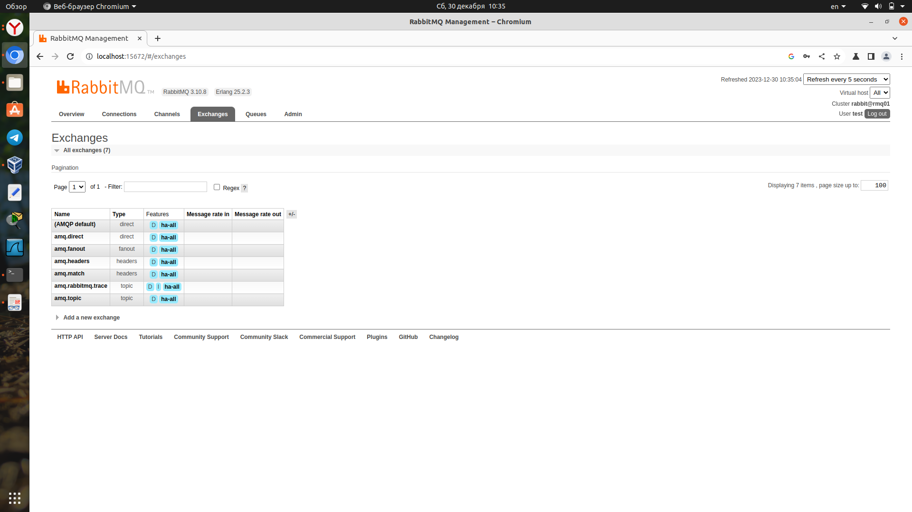
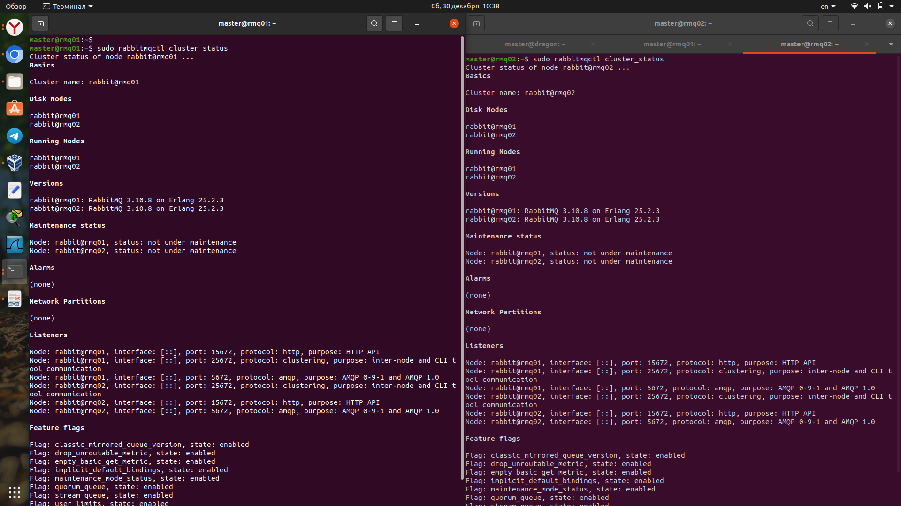
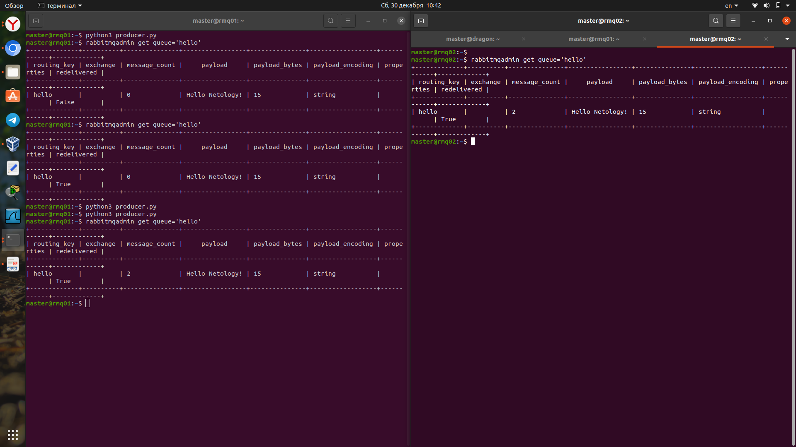
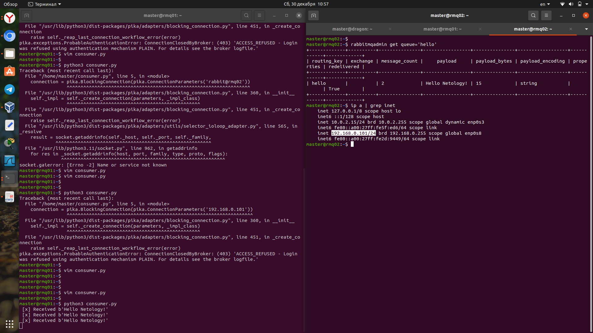

# Домашнее задание к занятию "`Очереди RabbitMQ`" - `Аблогин Павел`

---

### Задание 1

`Установил RabbitMQ. Добавил management plug-in.`

`Скриншот выполнения задания 1`

---

### Задание 2

1. `Установил пакет python pika`
2. `Отправил сообщения в очередь скриптом producer.py`
3. `Вычитал сообщения из очереди скриптом consumer.py`

`Скриншоты выполнения задания 2`

---

### Задание 3

1. `Создал вторую виртуальную машину rmq02 (192.168.0.101), установил rabbitmq.`
2. `Объединил две машины в кластер и создал политику ha-all на все очереди.`
3. `Записал сообщения в кластер скриптом producer.py`
4. `Отключил первую ноду rmq01 (192.168.0.100), к которой подключался из скрипта producer.py`
5. `Исправил параметры подключения в скрипте consumer.py yна вторую ноду и запустил его, считал сообщения из очереди.`

`Скриншоты выполнения задания 3`

---

